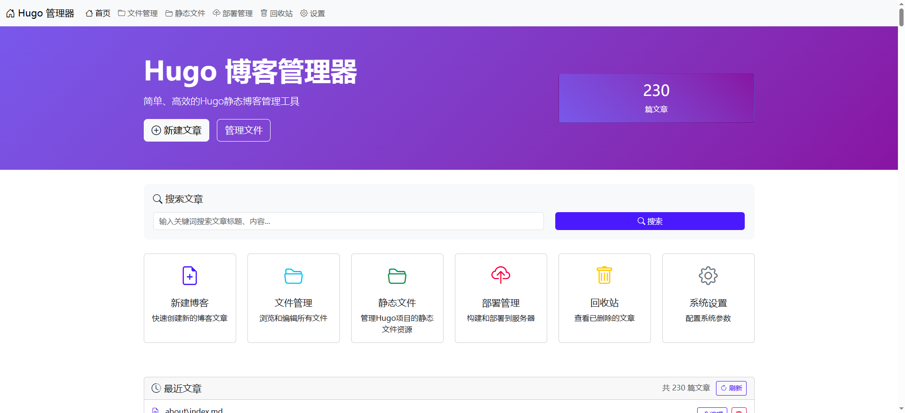
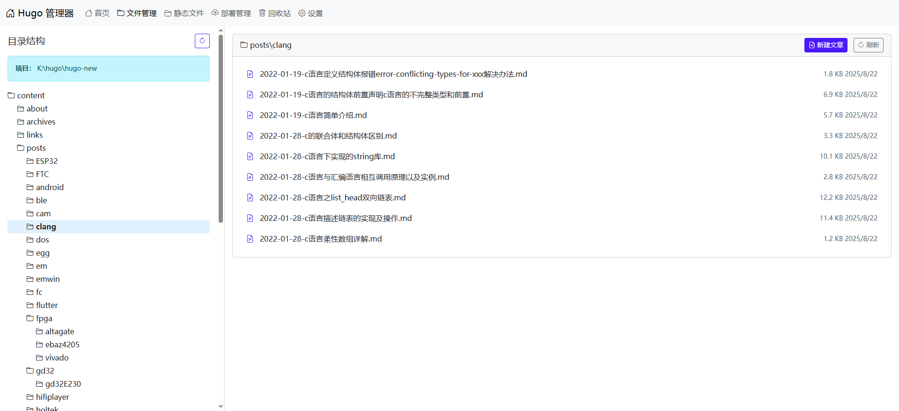
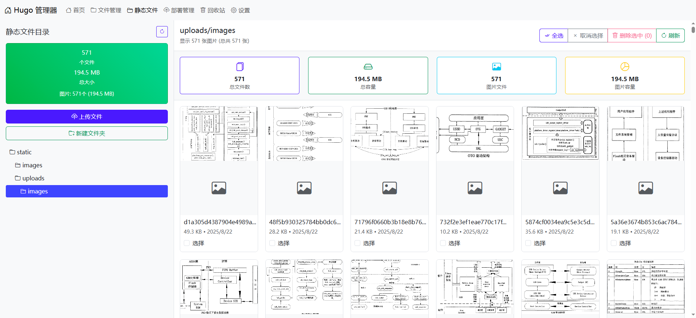

# Hugo 管理器

一个功能强大的基于Web的Hugo静态网站管理系统，使用Go和Bootstrap 5构建。

[中文文档](README_CN.md) | [English](README.md)

## 功能特性

### 📝 内容管理
- **文件管理**：浏览、编辑和管理Hugo内容文件，支持语法高亮
- **文章编辑器**：独立的编辑页面，支持Markdown和前置属性编辑
- **创建新文章**：快速创建文章，支持自定义模板
- **文件操作**：上传、删除、重命名和组织内容文件

### 🖼️ 静态文件管理
- **完整静态目录管理**：查看和管理Hugo static目录下的所有文件
- **图片预览**：大图预览功能，支持缩放查看
- **文件类型支持**：支持图片、CSS、JS、HTML、文档等多种文件类型
- **文件下载**：一键下载任意类型的文件
- **目录导航**：多层级目录支持，树形结构浏览
- **文件统计**：实时统计文件数量和磁盘使用情况

### 🗂️ 组织功能
- **回收站**：安全删除和恢复文章
- **目录树**：分层显示内容结构
- **搜索功能**：快速搜索文章和文件
- **文件类型图标**：可视化文件类型识别

### 🚀 部署管理
- **跨平台SSH**：原生Go SSH实现（无需外部依赖）
- **SSH配置**：支持密码和密钥认证的安全服务器连接
- **加密密码存储**：使用AES-GCM加密存储敏感凭据
- **Hugo构建**：一键Hugo站点生成
- **智能部署**：完整和增量部署选项
- **实时进度**：实时文件传输进度和详细日志
- **连接测试**：部署前验证SSH连通性
- **部署统计**：跟踪已部署文件、传输字节数和同步状态

### ⚙️ 系统功能
- **响应式界面**：精美的Bootstrap 5界面，适配所有设备
- **智能多语言支持**：先进的国际化系统，具备智能语言检测功能
  - **浏览器语言检测**：根据浏览器语言偏好自动检测并设置界面语言
  - **用户偏好优先**：用户主动选择的语言优先于浏览器检测
  - **持久化设置**：语言偏好保存到服务器配置中
  - **支持语言**：5种语言的完整翻译支持
    - 🇨🇳 简体中文
    - 🇹🇼 繁體中文
    - 🇯🇵 日本語
    - 🇺🇸 English (默认)
    - 🇷🇺 Русский
- **配置管理**：内置TOML配置编辑器
- **Hugo预览集成**：内置预览服务器，支持启动/停止控制
- **智能通知系统**：用户友好的通知提醒
- **文件编码修复**：自动修复文件编码问题
- **实时更新**：实时统计和文件监控，支持自动刷新
- **无外部依赖**：纯Go实现，最大兼容性保证

## 截图展示

### 仪表盘


### 文件管理


### 静态文件管理


### 部署管理


## 安装说明

### 系统要求
- Go 1.19 或更高版本
- Hugo（用于站点生成）
- 部署服务器SSH访问权限（可选）

### 快速开始

1. **克隆仓库**
   ```bash
   git clone https://github.com/grabbyte/hugomanager.git
   cd hugomanager
   ```

2. **安装依赖**
   ```bash
   go mod download
   ```

3. **配置Hugo项目路径**
   - 编辑 `config.json` 或使用Web界面
   - 设置你的Hugo项目根目录路径

4. **运行应用程序**
   ```bash
   go run main.go
   ```

5. **访问Web界面**
   - 打开浏览器访问：`http://localhost:8080`
   - 在设置页面配置你的Hugo项目路径

### 配置说明

应用程序使用 `config.json` 文件进行配置：

```json
{
  "hugo_project_path": "/path/to/your/hugo/project",
  "ssh": {
    "host": "your-server.com",
    "port": 22,
    "username": "your-username",
    "remote_path": "/var/www/html"
  }
}
```

## 使用指南

### 管理内容
1. 导航到**文件管理**浏览你的Hugo内容
2. 点击任意文件在编辑器中打开
3. 使用**新建文章**按钮创建新文章
4. 使用**回收站**功能安全删除文章

### 管理静态文件
1. 进入**静态文件**管理图片、CSS、JS和其他资源
2. 点击图片进行大图预览，支持缩放功能
3. 使用拖放或上传按钮添加新文件
4. 创建文件夹来组织你的静态文件
5. 一键下载任意文件

### 部署站点
1. 在**部署管理**中配置SSH设置
2. 使用**测试连接**按钮验证连接
3. 使用**构建**在本地生成Hugo站点
4. 使用**部署**上传到服务器
5. 使用**一键部署**实现构建+部署一步完成

### 文件统计
- 查看实时文件数量和磁盘使用情况
- 监控静态文件存储消耗
- 单独跟踪图片文件和其他资源

## API接口

### 内容管理
- `GET /api/files?path=<path>` - 列出目录中的文件
- `GET /api/file-content?path=<path>` - 获取文件内容
- `POST /api/save-file` - 保存文件内容
- `POST /api/create-article` - 创建新文章

### 静态文件管理
- `GET /api/images?path=<path>` - 列出静态文件
- `GET /api/image-stats` - 获取文件统计信息
- `POST /api/upload-image` - 上传文件
- `POST /api/delete-image` - 删除文件
- `GET /static/*filepath` - 提供静态文件服务

### 部署管理
- `GET /api/ssh-config` - 获取SSH配置
- `POST /api/ssh-config` - 更新SSH配置
- `POST /api/test-ssh` - 测试SSH连接
- `POST /api/build-hugo` - 构建Hugo站点
- `POST /api/deploy` - 部署到服务器
- `POST /api/build-and-deploy` - 构建并部署

## 开发说明

### 项目结构
```
hugo-manager-go/
├── controller/          # HTTP处理器
├── config/             # 配置管理
├── router/             # 路由定义
├── view/               # HTML模板
│   ├── home/           # 首页
│   ├── files/          # 文件管理
│   ├── images/         # 静态文件管理
│   ├── deploy/         # 部署管理
│   └── settings/       # 设置
├── main.go             # 应用程序入口
├── config.json         # 配置文件
└── README_CN.md
```

### 生产环境构建

```bash
# 为当前平台构建
go build -o hugo-manager main.go

# 为Linux构建
GOOS=linux GOARCH=amd64 go build -o hugo-manager-linux main.go

# 为Windows构建
GOOS=windows GOARCH=amd64 go build -o hugo-manager.exe main.go
```

## 贡献指南

1. Fork 这个仓库
2. 创建你的功能分支 (`git checkout -b feature/amazing-feature`)
3. 提交你的更改 (`git commit -m 'Add some amazing feature'`)
4. 推送到分支 (`git push origin feature/amazing-feature`)
5. 开启一个 Pull Request

## 许可证

本项目采用 MIT 许可证 - 查看 [LICENSE](LICENSE) 文件了解详情。

## 技术支持

如果你遇到任何问题或有疑问：
1. 查看 [Issues](https://github.com/grabbyte/hugomanager/issues) 页面
2. 如果你的问题尚未报告，创建新的issue
3. 提供详细的设置信息和问题描述

## 更新日志

### v1.0.0 (最新版本)
- ✅ 完整的静态文件管理系统
- ✅ 大图预览功能，支持下载
- ✅ 文件统计和磁盘使用监控
- ✅ 多层级目录导航
- ✅ 统一的响应式UI设计
- ✅ SSH部署与构建集成
- ✅ 回收站功能
- ✅ 实时文件操作

## 主要功能亮点

### 🎯 核心特性
- **完整的Hugo项目管理**：从内容创建到部署的全流程管理
- **直观的用户界面**：现代化的Bootstrap 5设计，操作简单直观
- **实时文件操作**：支持拖放上传、大图预览、一键下载
- **智能文件统计**：实时监控文件数量、类型分布和存储使用情况
- **安全的部署系统**：SSH密钥和密码认证，支持自动化部署流程

### 📊 统计功能
- **总文件数统计**：显示static目录下所有文件数量
- **存储容量监控**：实时显示文件占用的磁盘空间大小
- **图片文件专项统计**：单独统计图片文件的数量和容量
- **文件类型分析**：按文件扩展名统计不同类型文件的分布

### 🔧 技术特点
- **Go语言后端**：高性能的HTTP服务器，支持并发处理
- **Gin框架**：轻量级Web框架，快速响应用户请求
- **Bootstrap 5前端**：现代化响应式设计，兼容各种设备
- **模板引擎**：Go HTML模板，支持动态内容渲染
- **文件系统操作**：安全的文件读写和目录遍历
- **SSH集成**：支持远程服务器连接和文件同步

## 致谢

- [Hugo](https://gohugo.io/) - 世界上最快的网站构建框架
- [Gin](https://gin-gonic.com/) - 用Go编写的HTTP web框架
- [Bootstrap 5](https://getbootstrap.com/) - 强大的前端工具包
- [Bootstrap Icons](https://icons.getbootstrap.com/) - 官方图标库

---

由 Hugo Manager 团队用 ❤️ 制作