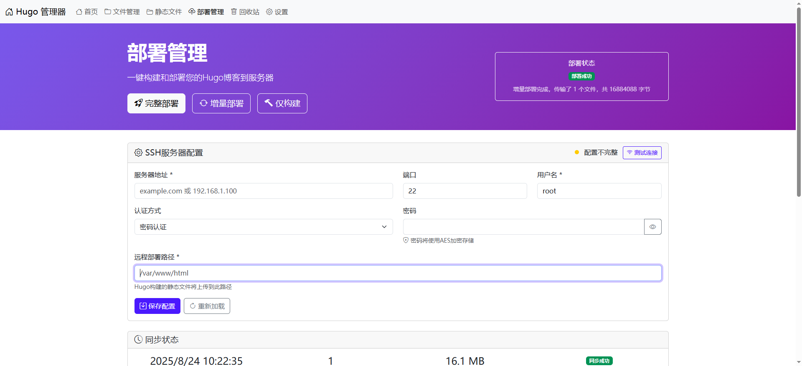

# Hugo Manager

A powerful web-based management system for Hugo static sites, built with Go and Bootstrap 5.

[中文文档](README_CN.md) | [English](README.md)

## Features

### 📝 Content Management
- **File Management**: Browse, edit, and manage Hugo content files with syntax highlighting
- **Article Editor**: Independent editor pages with Markdown support and front matter editing
- **Create New Articles**: Quick article creation with customizable templates
- **File Operations**: Upload, delete, rename, and organize content files

### 🖼️ Static File Management
- **Complete Static Directory Management**: View and manage all files in Hugo's static directory
- **Image Preview**: Large image preview with zoom functionality
- **File Type Support**: Support for images, CSS, JS, HTML, documents, and more
- **Download Files**: One-click download for any file type
- **Directory Navigation**: Multi-level directory support with tree view
- **File Statistics**: Real-time statistics of file count and disk usage

### 🗂️ Organization Features
- **Trash/Recycle Bin**: Safely delete and recover articles
- **Directory Tree**: Hierarchical view of content structure
- **Search Functionality**: Quick search through articles and files
- **File Type Icons**: Visual file type identification

### 🚀 Deployment Management
- **Cross-Platform SSH**: Native Go SSH implementation (no external dependencies)
- **SSH Configuration**: Secure server connection with password or key authentication
- **Encrypted Password Storage**: AES-GCM encryption for sensitive credentials
- **Hugo Build**: One-click Hugo site generation
- **Smart Deploy**: Full and incremental deployment options
- **Real-time Progress**: Live file transfer progress with detailed logging
- **Connection Testing**: Verify SSH connectivity before deployment
- **Deploy Statistics**: Track files deployed, bytes transferred, and sync status

### ⚙️ System Features
- **Responsive UI**: Beautiful Bootstrap 5 interface that works on all devices
- **Multi-language Support**: Chinese and English interface
- **Hugo Configuration Management**: Built-in TOML configuration editor
- **Smart Notifications**: User-friendly notification system
- **File Encoding Repair**: Fix file encoding issues automatically
- **Real-time Updates**: Live statistics and file monitoring with auto-refresh
- **No External Dependencies**: Pure Go implementation for maximum compatibility

## Screenshots

### Dashboard


### File Management


### Static File Management


### Deployment


## Installation

### Requirements
- Go 1.24 or higher
- Hugo (for site generation)
- SSH access to deployment server (optional)
- **No external SSH tools required** (built-in SSH support)

### Quick Start

1. **Clone the repository**
   ```bash
   git clone https://github.com/grabbyte/hugomanager.git
   cd hugomanager
   ```

2. **Install dependencies**
   ```bash
   go mod download
   ```

3. **Configure Hugo project path**
   - Edit `config.json` or use the web interface
   - Set your Hugo project root directory path

4. **Run the application**
   ```bash
   go run main.go
   ```

5. **Access the web interface**
   - Open your browser and visit: `http://localhost:8080`
   - Configure your Hugo project path in Settings

### Configuration

The application uses a `config.json` file for configuration:

```json
{
  "hugo_project_path": "/path/to/your/hugo/project",
  "ssh": {
    "host": "your-server.com",
    "port": 22,
    "username": "your-username",
    "key_path": "/path/to/private/key",
    "encrypted_password": "base64-encrypted-password",
    "remote_path": "/var/www/html"
  },
  "deployment": {
    "last_sync_time": "2025-01-15T10:30:00Z",
    "last_sync_status": "success",
    "files_deployed": 156,
    "bytes_transferred": 2048576
  }
}
```

## Usage

### Managing Content
1. Navigate to **File Management** to browse your Hugo content
2. Click on any file to open it in the editor
3. Create new articles using the **New Article** button
4. Use the **Trash** feature to safely delete articles

### Managing Static Files
1. Go to **Static Files** to manage images, CSS, JS, and other assets
2. Click on images for large preview with zoom functionality
3. Upload new files using drag & drop or the upload button
4. Create folders to organize your static files
5. Download any file with one click

### Deploying Your Site
1. Configure SSH settings in **Deployment Management**
   - Choose between password or SSH key authentication
   - Passwords are automatically encrypted with AES-GCM
   - Supports OpenSSH key format (automatic PPK conversion guidance)
2. Test your connection using the **Test Connection** button
   - 15-second timeout with detailed error messages
   - Cross-platform compatibility (Windows, Linux, macOS)
3. Use **Build** to generate your Hugo site locally
4. Choose deployment method:
   - **Full Deploy**: Upload all files (replaces server content)
   - **Incremental Deploy**: Only upload changed files (faster)
5. Use **One-Click Deploy** for build + deploy in one step
6. Monitor real-time progress in the deployment log
7. View deployment statistics and sync status

### File Statistics
- View real-time file count and disk usage
- Monitor static file storage consumption
- Track image files separately from other assets

## API Endpoints

### Content Management
- `GET /api/files?path=<path>` - List files in directory
- `GET /api/file-content?path=<path>` - Get file content
- `POST /api/save-file` - Save file content
- `POST /api/create-article` - Create new article

### Static File Management
- `GET /api/images?path=<path>` - List static files
- `GET /api/image-stats` - Get file statistics
- `POST /api/upload-image` - Upload files
- `POST /api/delete-image` - Delete files
- `GET /static/*filepath` - Serve static files

### Deployment
- `GET /api/ssh-config` - Get SSH configuration and deployment status
- `POST /api/ssh-config` - Update SSH configuration
- `POST /api/ssh-config-encrypted` - Update SSH configuration with encryption
- `POST /api/set-decryption-key` - Set master password for decryption
- `GET /api/check-decryption-status` - Check if passwords are decrypted
- `POST /api/test-ssh` - Test SSH connection (native Go implementation)
- `POST /api/build-hugo` - Build Hugo site
- `POST /api/deploy` - Full deployment to server
- `POST /api/incremental-deploy` - Incremental deployment (changed files only)
- `POST /api/build-and-deploy` - Build and full deploy
- `POST /api/incremental-build-and-deploy` - Build and incremental deploy

### Hugo Configuration
- `GET /api/hugo-config` - Get Hugo configuration
- `POST /api/hugo-config` - Update Hugo configuration
- `GET /api/hugo-config/preview` - Preview Hugo configuration

## Development

### Project Structure
```
hugo-manager-go/
├── controller/          # HTTP handlers
│   ├── deploy.go       # Deployment management with native SSH
│   ├── files.go        # File management operations
│   ├── hugo_config.go  # Hugo configuration editor
│   ├── images.go       # Static file management
│   └── ...
├── config/             # Configuration management
│   └── config.go       # Config with encryption support
├── utils/              # Utility modules
│   ├── ssh.go          # Native SSH implementation
│   ├── filename.go     # File encoding utilities
│   └── markdown.go     # Markdown processing
├── router/             # Route definitions
├── view/               # HTML templates
│   ├── home/           # Dashboard
│   ├── files/          # File management
│   ├── images/         # Static file management
│   ├── deploy/         # Deployment interface
│   ├── settings/       # Configuration UI
│   └── trash/          # Recycle bin
├── static/             # Static assets
├── main.go             # Application entry point
├── config.json         # Configuration file
├── go.mod              # Go module dependencies
└── README.md
```

### Building for Production

```bash
# Build for current platform
go build -o hugo-manager main.go

# Build for Linux
GOOS=linux GOARCH=amd64 go build -o hugo-manager-linux main.go

# Build for Windows
GOOS=windows GOARCH=amd64 go build -o hugo-manager.exe main.go
```

## Contributing

1. Fork the repository
2. Create your feature branch (`git checkout -b feature/amazing-feature`)
3. Commit your changes (`git commit -m 'Add some amazing feature'`)
4. Push to the branch (`git push origin feature/amazing-feature`)
5. Open a Pull Request

## License

This project is licensed under the MIT License - see the [LICENSE](LICENSE) file for details.

## Support

If you encounter any issues or have questions:
1. Check the [Issues](https://github.com/grabbyte/hugomanager/issues) page
2. Create a new issue if your problem isn't already reported
3. Provide detailed information about your setup and the issue

## Changelog

### v2.0.0 (Latest - 2025-01-24)
- 🚀 **Native SSH Implementation**: Pure Go SSH support (no external dependencies)
- 🔐 **Enhanced Security**: AES-GCM password encryption with master password
- 📊 **Smart Deployment**: Incremental sync with real-time progress tracking
- 🎯 **Cross-Platform**: Windows, Linux, macOS compatibility without external tools
- ⚡ **Performance**: Optimized file transfer with detailed progress logging
- 🔧 **Hugo Config Editor**: Built-in TOML configuration management
- 📈 **Deployment Analytics**: Track sync status, files deployed, bytes transferred
- 🎨 **Modern UI**: Smart notifications and auto-refresh capabilities
- 🛠️ **Error Handling**: Comprehensive SSH error detection and user guidance

### v1.0.0
- ✅ Complete static file management system
- ✅ Large image preview with download functionality
- ✅ File statistics and disk usage monitoring
- ✅ Multi-level directory navigation
- ✅ Unified responsive UI design
- ✅ SSH deployment with build integration
- ✅ Trash/recycle bin functionality
- ✅ Real-time file operations

## Acknowledgments

- [Hugo](https://gohugo.io/) - The world's fastest framework for building websites
- [Gin](https://gin-gonic.com/) - HTTP web framework written in Go
- [Bootstrap 5](https://getbootstrap.com/) - Powerful frontend toolkit
- [Bootstrap Icons](https://icons.getbootstrap.com/) - Official icon library

---

Made with ❤️ by the Hugo Manager team